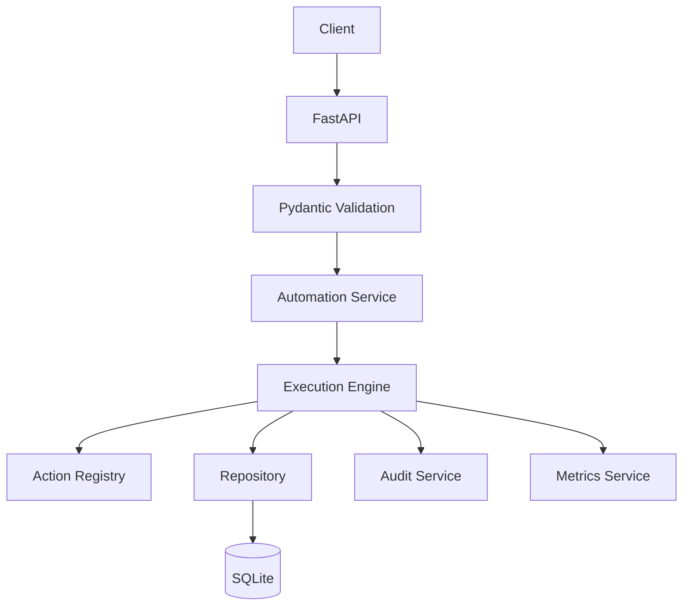

# ⚙️ AutoServe API — Automation Backend Platform

> **A reusable FastAPI automation backend for deterministic job execution, state management, idempotency, retries, auditability, metrics, and SQLite persistence.**


---

## 🎯 What It Solves

Automation backends need more than a function that performs an action. They need controlled job lifecycles, duplicate protection, failure handling, retries, audit history, persistence, and operational visibility.

**AutoServe API packages those concerns into a local, deterministic backend.**

```text
Client
  ↓
FastAPI
  ↓
Pydantic Validation
  ↓
Job Manager
  ↓
State Machine
  ↓
Execution Engine
  ↓
Action Registry
  ↓
SQLite
  ├── Jobs
  ├── Runs
  ├── Results
  └── Audit Logs
```

The implementation is intentionally local-only: actions are deterministic Python functions and do not send real emails, call cloud APIs, or require credentials.

## 🏗️ Architecture



| Layer | Responsibility |
|---|---|
| API | FastAPI routes and schemas |
| Service | Job execution, runs, audit, and metrics |
| Core | State machine, action registry, idempotency, retries |
| Repository | SQLite persistence and queries |
| Data | Jobs, runs, results, and audit records |

## ⚙️ Key Features

- 🌐 FastAPI REST API with OpenAPI/Swagger
- 🗄️ SQLite repository with parameterized SQL
- 🔄 Explicit automation job state machine
- ♻️ Request-ID idempotency
- ▶️ Local action registry and execution engine
- 🧪 Run tracking and action-result persistence
- 🔁 Controlled retries with configurable limits
- 📝 Audit logging for lifecycle events
- 📊 Database-backed aggregate metrics
- 🧱 Isolated test database configuration
- 🔒 No external side effects

## 🔄 Execution Lifecycle

1. Client submits a job request.
2. Validation checks the automation type, payload, and request ID.
3. The job is stored with `pending` status.
4. An execution request starts the job.
5. The state machine validates the transition.
6. The action registry resolves the registered function.
7. The action executes locally and returns a deterministic result.
8. The result is persisted.
9. The job/run becomes completed or failed.
10. Audit events are recorded.
11. Metrics are calculated from the database.

## 🧩 Supported Automation Actions

| Action | Purpose |
|---|---|
| `send_notification` | Simulate notification delivery |
| `create_task` | Create a local task result |
| `update_customer_status` | Update a customer-status result |
| `generate_summary` | Generate a deterministic text summary |

These actions are local simulations and never call external services.

## 🌐 API Surface

| Method | Endpoint | Purpose |
|---|---|---|
| `GET` | `/health` | Health check |
| `POST` | `/jobs` | Create a job |
| `GET` | `/jobs` | List jobs |
| `GET` | `/jobs/{job_id}` | Retrieve a job |
| `POST` | `/jobs/{job_id}/execute` | Execute a job |
| `POST` | `/jobs/{job_id}/retry` | Retry a failed job |
| `GET` | `/automations` | List supported automations |
| `GET` | `/runs` | List runs |
| `GET` | `/runs/{run_id}` | Retrieve a run |
| `GET` | `/metrics/summary` | View aggregate metrics |

## ♻️ Idempotency & Retry

### Idempotency

Every job request contains a unique `request_id`. Re-submitting the same request returns the existing job instead of creating a duplicate.

### Retry Control

- Failed jobs can be retried.
- Completed jobs cannot be retried.
- Each retry creates a new run.
- Retry count is tracked.
- A configured maximum retry count is enforced.
- Retry failures remain recorded.

## 📝 Auditability

Important lifecycle events are stored in `audit_logs`, including:

- `JOB_CREATED`
- `JOB_STARTED`
- `JOB_COMPLETED`
- `JOB_FAILED`
- `JOB_RETRIED`
- `ACTION_EXECUTED`
- `ACTION_FAILED`

## 📊 Metrics

The metrics service calculates values dynamically from the database:

- Total jobs
- Pending jobs
- Running jobs
- Completed jobs
- Failed jobs
- Total runs
- Successful runs
- Failed runs
- Success rate

## 🗃️ Database Design

Core SQLite tables:

```text
automation_jobs
automation_runs
action_results
audit_logs
```

Important design choices include unique `request_id` values for idempotency, controlled job status transitions, JSON serialization for payload/result/metadata, and parameterized SQL.

## 🧪 Verification

Run the complete test suite with:

```powershell
pytest
```

The project includes isolated tests for health, schemas, state transitions, action registration, job creation/execution, idempotency, retries, repositories, audit logging, metrics, API behavior, and error handling.

## 🚀 Quick Start

```powershell
python -m venv .venv
.\.venv\Scripts\activate
python -m pip install -r requirements.txt
python -m src.main
```

Application:

```text
http://127.0.0.1:8000
```

Swagger/OpenAPI:

```text
http://127.0.0.1:8000/docs
http://127.0.0.1:8000/redoc
http://127.0.0.1:8000/openapi.json
```

## 📁 Project Structure

```text
AutoServe-API/
├── data/
├── docs/
│   ├── architecture/
│   └── setup/
├── src/
│   ├── api/
│   ├── core/
│   ├── database/
│   ├── models/
│   ├── services/
│   ├── config.py
│   └── main.py
├── tests/
├── .gitignore
├── pytest.ini
├── requirements.txt
└── README.md
```

## 🛠️ Engineering Practices

- PEP 8 naming and formatting
- Typed models and function signatures
- Small, focused service/repository responsibilities
- Explicit state validation
- Local deterministic execution
- Parameterized SQL
- No credentials or cloud dependencies

## 💼 Portfolio Value

AutoServe API demonstrates backend engineering patterns for **automation platforms**, including REST API design, lifecycle management, idempotency, retry control, auditability, persistence, metrics, and deterministic execution.

## 🔮 Future Extensions

Potential later extensions include richer run filtering, queue/background execution, plugin-based automation types, observability dashboards, and more advanced retry/backoff policies.
