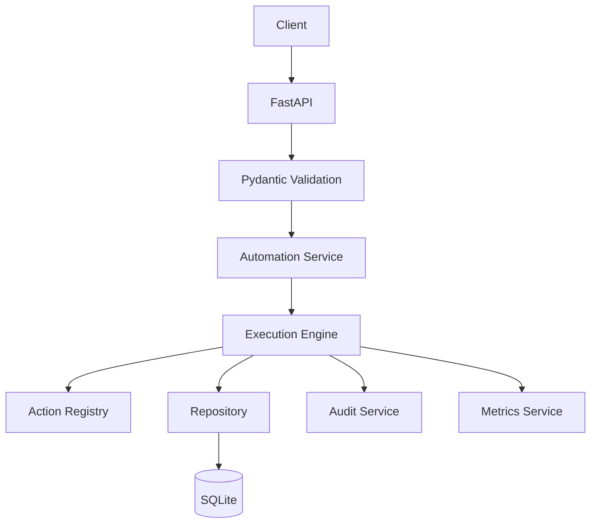

# AutoServe API — Automation Backend Platform

## 1. Overview

AutoServe API is a reusable FastAPI automation backend designed for local, deterministic automation workflows. It demonstrates a professional backend architecture for creating jobs, validating requests, storing job state in SQLite, executing automation actions, tracking runs, recording audit events, enforcing idempotency, handling retries, and exposing metrics through a clean REST API.

The project is intentionally local-only. All automation actions are deterministic Python functions running inside the application itself. They do not send real emails, call cloud APIs, or require credentials.

## 2. Why This Project Exists

This project exists to demonstrate production-oriented backend engineering for automation systems without unnecessary infrastructure. The focus is on:

- clean service-layer architecture
- explicit job lifecycle and state machine rules
- idempotent request handling
- retry control and failure recording
- auditability and metrics
- local SQLite persistence
- FastAPI + OpenAPI documentation

## 3. Key Features

- FastAPI REST API with automatic OpenAPI and Swagger docs
- SQLite-backed repository layer with parameterized SQL
- automation job state machine with controlled transitions
- request idempotency using unique request IDs
- local action registry for automation execution
- run tracking and action result persistence
- retry support with configurable retry limits
- audit log generation for important lifecycle events
- aggregate metrics calculations from the database
- isolated test database configuration

## 4. Architecture

The backend follows a simple layered design:

- API layer: FastAPI routes and request/response schemas
- Service layer: job execution, run management, audit and metrics logic
- Core layer: state machine, action registry, idempotency, retry logic
- Repository layer: SQLite persistence and queries
- Data layer: SQLite database with automation jobs, runs, results, and audit logs



## 5. Automation Execution Flow

The execution lifecycle is intentionally explicit:

1. Client submits a job creation request.
2. Request validation checks automation type, payload, and request ID.
3. The job is stored in SQLite with a `pending` status.
4. A separate execution request triggers the execution engine.
5. The state machine validates transitions.
6. The action registry resolves the registered function.
7. The function executes locally and returns a deterministic result.
8. The result is stored as an action result.
9. The job and run are marked complete or failed.
10. The audit service writes event records.
11. Metrics are calculated from the database.

## 6. Supported Automation Actions

These actions are local deterministic simulations and never call external services:

- `send_notification`
- `create_task`
- `update_customer_status`
- `generate_summary`

Example payloads:

```json
{
  "recipient": "customer@example.com",
  "message": "Your request has been processed."
}
```

```json
{
  "title": "Follow up with customer",
  "priority": "high"
}
```

```json
{
  "customer_id": "CUST-001",
  "status": "active"
}
```

```json
{
  "text": "Business automation project completed successfully."
}
```

## 7. API Endpoints

- `GET /health`
- `POST /jobs`
- `GET /jobs`
- `GET /jobs/{job_id}`
- `POST /jobs/{job_id}/execute`
- `POST /jobs/{job_id}/retry`
- `GET /automations`
- `GET /runs`
- `GET /runs/{run_id}`
- `GET /metrics/summary`

## 8. Database Design

The project uses SQLite with these core tables:

- `automation_jobs`
- `automation_runs`
- `action_results`
- `audit_logs`

Important design details:

- `request_id` is unique to support idempotency.
- job status values are controlled to avoid free-form transitions.
- JSON is used for payload/result/metadata serialization.
- parameterized SQL is used throughout the repository layer.

## 9. Idempotency

Each job request includes a `request_id`.

If the same request is submitted again, the API returns the existing job instead of creating a duplicate. This is supported by a uniqueness constraint on `request_id` and a repository-level lookup before insertion.

## 10. Retry System

Retries are explicit and controlled.

- failed jobs can be retried
- completed jobs cannot be retried
- each retry creates a new run
- retry count increments on a successful retry attempt
- a configured maximum retry count is enforced
- retry failures are recorded as failed runs

## 11. Audit Logging

The system records operational events for traceability, including:

- `JOB_CREATED`
- `JOB_STARTED`
- `JOB_COMPLETED`
- `JOB_FAILED`
- `JOB_RETRIED`
- `ACTION_EXECUTED`
- `ACTION_FAILED`

These events are stored in the `audit_logs` table with structured metadata.

## 12. Metrics

The metrics service calculates useful aggregate values dynamically from the database, including:

- total jobs
- pending jobs
- running jobs
- completed jobs
- failed jobs
- total runs
- successful runs
- failed runs
- success rate

## 13. Project Structure

```text
AutoServe-API/
├── .gitignore
├── README.md
├── requirements.txt
├── pytest.ini
├── data/
│   └── .gitkeep
├── docs/
│   ├── architecture/
│   │   └── architecture.md
│   └── setup/
│       └── setup.md
├── src/
│   ├── __init__.py
│   ├── config.py
│   ├── main.py
│   ├── api/
│   │   ├── __init__.py
│   │   ├── routes.py
│   │   └── schemas.py
│   ├── core/
│   │   ├── __init__.py
│   │   ├── action_registry.py
│   │   ├── execution_engine.py
│   │   ├── idempotency.py
│   │   ├── job_manager.py
│   │   ├── retry_manager.py
│   │   └── state_machine.py
│   ├── database/
│   │   ├── __init__.py
│   │   ├── connection.py
│   │   └── repository.py
│   ├── models/
│   │   ├── __init__.py
│   │   └── automation.py
│   └── services/
│       ├── __init__.py
│       ├── audit_service.py
│       ├── automation_service.py
│       ├── metrics_service.py
│       └── run_service.py
└── tests/
    ├── __init__.py
    ├── conftest.py
    ├── test_health.py
    ├── test_schemas.py
    ├── test_state_machine.py
    ├── test_action_registry.py
    ├── test_job_creation.py
    ├── test_job_execution.py
    ├── test_idempotency.py
    ├── test_retry.py
    ├── test_repository.py
    ├── test_audit.py
    ├── test_metrics.py
    ├── test_api_jobs.py
    ├── test_api_runs.py
    └── test_error_handling.py
```

## 14. Installation

```bash
python -m venv .venv
```

Windows activation:

```powershell
.venv\Scripts\activate
```

Install dependencies:

```bash
pip install -r requirements.txt
```

## 15. Running the API

From the project root:

```bash
python -m src.main
```

The application starts on:

```text
http://127.0.0.1:8000
```

## 16. Running Tests

```bash
pytest
```

## 17. Swagger / OpenAPI

FastAPI exposes automatic API documentation at:

- http://127.0.0.1:8000/docs
- http://127.0.0.1:8000/redoc
- http://127.0.0.1:8000/openapi.json

## 18. Example API Workflow

### Create a job

```http
POST /jobs
```

```json
{
  "automation_type": "create_task",
  "payload": {
    "title": "Follow up with customer",
    "priority": "high"
  },
  "request_id": "REQ-001"
}
```

### Execute the job

```http
POST /jobs/{job_id}/execute
```

This resolves the `create_task` action, executes it locally, stores the run, and moves the job to `completed` when successful.

### Failed execution and retry

A failed job can be retried with:

```http
POST /jobs/{job_id}/retry
```

This creates a fresh run and updates the retry count, while preserving the audit trail.

## 19. Engineering Practices

- PEP 8 naming and formatting
- explicit state validation instead of loose string checks
- typed models and function signatures
- small, focused service and repository responsibilities
- local-only deterministic action execution
- no unsafe SQL interpolation
- no credentials or cloud dependencies

## 20. Future Improvements

Potential follow-ups for a later version include:

- richer run history and event filtering
- job queue semantics for background execution
- plugin architecture for more automation types
- better observability dashboards
- richer retry policies with backoff strategies

These enhancements remain intentionally out of scope for this repository to keep the project focused and clean.
