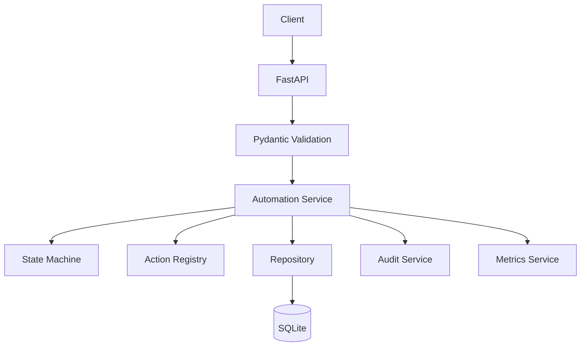

# Architecture

## API layer

The API layer is implemented with FastAPI and exposes a focused set of endpoints for job creation, execution, retry, automation lookup, run inspection, and metrics. Each route is intentionally thin and delegates heavy logic to the service layer.

## Schema validation

Pydantic v2 models validate request correctness before business logic is reached. This includes required fields, payload shape checks, automation type validation, and request ID validation. Invalid inputs are rejected before they reach the database.

## Service layer

Services manage the actual business logic for automation operations:

- `AutomationService` handles job creation, retrieval, execution, and retries
- `RunService` handles runs and run state changes
- `AuditService` writes structured lifecycle events
- `MetricsService` calculates aggregate values from stored data

## Core execution engine

The execution flow is centered around the action registry and state machine. A job transitions through the lifecycle as it moves from pending to running to completed or failed, with retries adding a controlled re-entry from failed to running.

## Action registry

The action registry binds automation names to local Python functions. These are deterministic and safe local simulations, not real external integrations. Each function returns a result payload that is persisted as the action result.

## State machine

A central state machine validates transitions and enforces rules such as:

- pending -> running
- running -> completed
- running -> failed
- failed -> running (retry)
- completed -> no transition

Invalid transitions raise a controlled domain error.

## Repository layer

The repository is responsible for parameterized SQLite operations. It handles:

- database initialization
- job CRUD operations
- run creation/update
- action result persistence
- audit log persistence
- metrics aggregation

## SQLite

SQLite is used as the local persistence layer for the project. The schema keeps the design simple and explicit, which makes the project easy to inspect and run without external services.

## Audit system

Every significant lifecycle event creates an audit log entry. This supports traceability and demonstrates observability for operational workflows.

## Metrics

Metrics are calculated directly from the database so that the numbers always reflect current state. This supports dashboards, health checks, and operational reporting without duplicating state in memory.

## Retry mechanism

The retry mechanism is controlled and explicit. A failed job may reset to running only within the configured retry limit, and each retry creates a fresh execution run. Completed jobs cannot be retried.

## Idempotency

The project implements request-based idempotency using a unique `request_id` domain. Duplicate submissions return the existing job instead of creating another one.

## Execution lifecycle

1. Client creates job
2. Validation ensures request integrity
3. Job is inserted as pending
4. Execution is triggered
5. State machine validates the transition
6. Action registry resolves the correct local action
7. Action executes and returns data
8. Result is persisted
9. Job/run state is updated
10. Audit events are logged
11. Metrics are recalculated from the database
