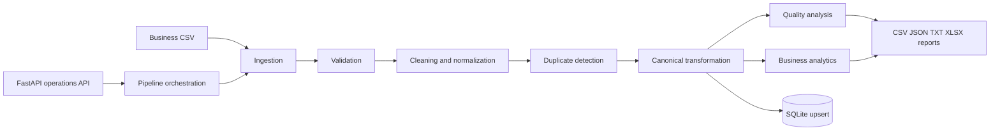

# 📊 DataFlow Pro — Business Data Processing Pipeline

> **A production-minded local data pipeline that turns messy business transaction data into validated records, quality intelligence, KPIs, SQLite persistence, and shareable reports.**


---

## 🎯 What It Solves

Business transaction exports commonly contain inconsistent capitalization, missing values, duplicate orders, malformed contact data, invalid numbers, and unreliable totals.

**DataFlow Pro makes data quality explicit and repeatable** instead of silently passing bad records through the system.

```text
Business CSV
    ↓
Ingestion
    ↓
Validation
    ↓
Cleaning & Normalization
    ↓
Duplicate Detection
    ↓
Canonical Transformation
    ↓
Quality Analysis + Analytics
    ↓
SQLite Persistence
    ↓
Reports + API
```

## 🏗️ Architecture



## ⚙️ Core Capabilities

- 📥 CSV ingestion with required-column checks
- 🧱 Pydantic-backed canonical business model
- 🧹 Type conversion and normalization
- 🛡️ Missing-value and business-rule validation
- ♻️ Deterministic duplicate detection by `order_id`
- 🧮 Calculated totals and high-value classification
- 📈 Quality score and validation-error reporting
- 📊 Revenue, volume, status, region, product, and monthly analytics
- 🗄️ SQLite persistence with parameterized SQL and upsert behavior
- 📑 CSV, JSON, text, and Excel reporting
- 🌐 FastAPI operational API
- 🧪 **37 isolated pytest tests**

## 🔄 Processing Rules

1. **Ingest** checks the required CSV columns.
2. **Validate** records missing values, invalid numbers, emails, statuses, and dates.
3. **Clean** trims whitespace, normalizes case, applies safe defaults such as USD, and parses dates.
4. **Deduplicate** keeps the first valid occurrence of each `order_id`.
5. **Transform** calculates `total_amount = quantity × unit_price` plus derived month/year fields.
6. **Analyze** produces quality metrics and business analytics.
7. **Persist** upserts canonical records and stores the processing run.
8. **Report** writes CSV, JSON, TXT, and Excel outputs.

### Data Quality

The sample dataset intentionally includes duplicate orders, formatting issues, malformed emails, invalid quantities/prices, a malformed date, missing customer data, and inconsistent source totals.

The quality score is:

`valid records / input records × 100`

The source `total_amount` is not trusted; canonical totals are calculated from quantity and unit price.

## 📈 Business Metrics

The pipeline calculates:

- Total revenue
- Order count and quantity
- Average order value
- Completed revenue
- Cancelled and refunded counts
- High-value count
- Revenue by category, region, and product
- Status counts
- Monthly revenue

## 🌐 API

| Method | Endpoint | Purpose |
|---|---|---|
| `GET` | `/health` | Health check |
| `POST` | `/pipeline/run` | Run the pipeline |
| `GET` | `/pipeline/runs` | List processing runs |
| `GET` | `/pipeline/runs/{run_id}` | Retrieve a run |
| `GET` | `/analytics/overview` | View analytics |
| `GET` | `/records` | List canonical records |
| `GET` | `/records/{order_id}` | Retrieve an order |
| `GET` | `/quality/latest` | View latest quality report |

Input paths are restricted to the project `data` directory, and API errors do not expose tracebacks.

## 🧪 Verification

```powershell
pytest
```

Tests use temporary project folders and SQLite databases. They do not depend on existing runtime files, network access, Docker, or external services.

## 🚀 Quick Start

```powershell
python -m venv .venv
.\.venv\Scripts\Activate.ps1
python -m pip install -r requirements.txt
```

Run the pipeline:

```powershell
python -c "from src.config import Settings; from src.core.pipeline import Pipeline; print(Pipeline(Settings.for_project()).run())"
```

Start the API:

```powershell
python -m src.main
```

Swagger:

```text
http://127.0.0.1:8000/docs
```

## 📦 Example API Request

```powershell
Invoke-RestMethod -Uri http://127.0.0.1:8000/pipeline/run -Method Post -ContentType 'application/json' -Body '{}'
```

The sample currently processes **24 rows**, with **19 valid records, 5 invalid records, and 1 duplicate**; these values are calculated dynamically by the pipeline.

## 📁 Project Structure

```text
DataFlow-Pro/
├── data/
│   ├── input/
│   └── output/
├── docs/
│   ├── architecture/
│   └── setup/
├── src/
│   ├── api/
│   ├── core/
│   ├── database/
│   ├── models/
│   └── services/
├── tests/
├── requirements.txt
└── README.md
```

## 📤 Generated Outputs

- `data/output/clean_business_data.csv`: canonical valid records
- `data/output/data_quality_report.json`: quality counts and validation errors
- `data/output/business_analytics.json`: calculated KPIs and groupings
- `data/output/business_summary.txt`: readable operational summary
- `data/output/business_report.xlsx`: multi-sheet Excel report
- `data/dataflow.sqlite3`: ignored SQLite operational store

## 🛠️ Technology Stack

`Python 3.11+` • `pandas` • `Pydantic 2` • `FastAPI` • `Uvicorn` • `SQLite` • `pytest` • `httpx` • `openpyxl`

## 🔐 Production Considerations

The local implementation is intentionally self-contained. Production extensions could add object storage, authenticated API access, scheduled jobs or queues, retries/dead-letter handling, metrics and alerting, retention policies, schema versioning, a managed database, and stronger data lineage.

## 💼 Portfolio Value

DataFlow Pro demonstrates practical **data engineering + business automation** skills through modular pipeline design, defensive validation, explainable data-quality handling, deterministic transformations, safe persistence, reporting, API operations, and isolated tests.
