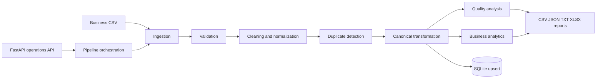

# DataFlow Pro - Business Data Processing Pipeline

## Overview

DataFlow Pro is a production-minded local pipeline for turning messy business transaction data into validated canonical records, quality intelligence, business KPIs, SQLite persistence, and shareable reports. It is designed to demonstrate the engineering behind reliable business data automation rather than merely reading a CSV file.

## Why This Project Exists

Businesses frequently receive order data from spreadsheets, exports, and operational systems with inconsistent capitalization, missing values, duplicate orders, malformed contact data, and unreliable totals. DataFlow Pro makes those problems visible and repeatable: invalid rows are explained, duplicates are handled deterministically, and business metrics are calculated from trusted canonical fields.

## Core Capabilities

- CSV ingestion with required-column checks
- Pydantic-backed canonical business model
- Type conversion and normalization
- Missing-value and business-rule validation
- Deterministic duplicate detection by `order_id`
- Calculated totals and high-value classification
- Quality score and error counts
- Revenue, volume, status, region, product, and monthly analytics
- SQLite persistence with parameterized SQL and upsert behavior
- CSV, JSON, text, and Excel reports
- FastAPI operational API
- 37 isolated pytest tests

## Architecture



## Processing Flow

1. **Ingest** reads a CSV and checks that required columns exist.
2. **Validate** records missing values, invalid numbers, email formats, statuses, and dates without discarding the source row prematurely.
3. **Clean** trims whitespace, normalizes case, fills safe defaults such as USD, and parses dates.
4. **Deduplicate** retains the first valid occurrence of each `order_id`; later occurrences are counted in quality reporting.
5. **Transform** calculates `total_amount = quantity * unit_price`, derived month/year fields, and the configurable high-value flag.
6. **Quality and analytics** produce structured reports from the processed frame.
7. **Persist** upserts canonical records and stores the processing run.
8. **Report** writes clean CSV, quality JSON, analytics JSON, summary text, and an Excel workbook.

## Data Quality

The sample dataset intentionally includes duplicate orders, whitespace and capitalization issues, malformed emails, invalid quantities and prices, a malformed date, missing customer data, and inconsistent source totals. The quality score is calculated as:

`valid records / input records * 100`

The source `total_amount` is never trusted; canonical totals are calculated from quantity and unit price. Duplicate policy is deterministic: the first valid row for an `order_id` is canonical, while subsequent valid rows are counted as duplicates rather than silently ignored.

## Business Metrics

The pipeline calculates total revenue, order count, quantity, average order value, completed revenue, cancelled and refunded counts, high-value count, revenue by category/region/product, status counts, and monthly revenue.

## API

- `GET /health`
- `POST /pipeline/run` with optional `{ "input_path": "data/input/sample_business_data.csv" }`
- `GET /pipeline/runs`
- `GET /pipeline/runs/{run_id}`
- `GET /analytics/overview`
- `GET /records?limit=100&offset=0`
- `GET /records/{order_id}`
- `GET /quality/latest`

Input paths are restricted to the project `data` directory. API errors are structured and do not expose tracebacks.

## Project Structure

```text
DataFlow-Pro/
  data/input/sample_business_data.csv
  data/output/.gitkeep
  docs/architecture/architecture.md
  docs/setup/setup.md
  src/api/              API schemas and routes
  src/core/             validation, cleaning, transformation, quality, analytics, pipeline
  src/database/         SQLite connection and repository
  src/models/           canonical business models
  src/services/         ingestion, processing, quality, reporting
  tests/                isolated unit, integration, and API tests
```

## Installation

```powershell
python -m venv .venv
.\.venv\Scripts\Activate.ps1
python -m pip install -r requirements.txt
```

## Running

Run the sample pipeline through Python:

```powershell
python -c "from src.config import Settings; from src.core.pipeline import Pipeline; print(Pipeline(Settings.for_project()).run())"
```

Start the API:

```powershell
python -m src.main
```

Swagger is available at `http://127.0.0.1:8000/docs`.

## Running Tests

```powershell
pytest
```

Tests use temporary project folders and SQLite databases. They do not depend on existing runtime files, network access, Docker, or external services.

## Example

```powershell
Invoke-RestMethod -Uri http://127.0.0.1:8000/pipeline/run -Method Post -ContentType 'application/json' -Body '{}'
```

A successful result includes the run ID, input/valid/invalid/duplicate counts, and generated report paths. The sample currently processes 24 rows with 19 valid records, 5 invalid records, and 1 duplicate; those values are calculated dynamically.

## Generated Outputs

- `data/output/clean_business_data.csv`: canonical valid records
- `data/output/data_quality_report.json`: quality counts, score, and validation errors
- `data/output/business_analytics.json`: calculated KPIs and groupings
- `data/output/business_summary.txt`: readable operational summary
- `data/output/business_report.xlsx`: Summary, Clean Data, Data Quality, Revenue by Category, and Revenue by Region sheets
- `data/dataflow.sqlite3`: ignored SQLite operational store

## Technology Stack

Python 3.11+, pandas, Pydantic 2, SQLite, FastAPI, Uvicorn, pytest, httpx, and openpyxl.

## Production Considerations

The local implementation is intentionally self-contained. A production deployment could add object storage for raw files, authenticated API access, scheduled jobs or a queue, retries and dead-letter handling, metrics and alerting, retention policies, schema versioning, a managed database, and stronger data lineage. Those are extensions rather than hidden requirements of this local portfolio project.

## Portfolio Value

DataFlow Pro demonstrates practical data engineering and business automation skills: modular pipeline design, defensive validation, explainable data-quality handling, deterministic transformations, safe persistence, reporting, API operations, and isolated automated tests.
