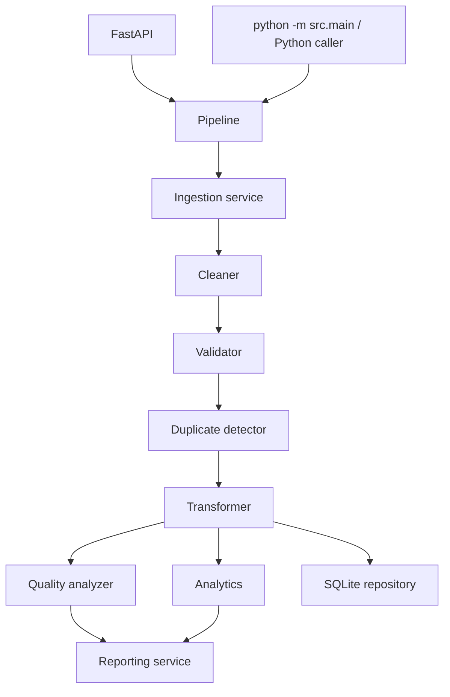

# DataFlow Pro Architecture

## Overview

DataFlow Pro is a modular monolith organized around a deterministic batch pipeline. The API and command-line entry points call the same `Pipeline` orchestration object, while transformations remain usable as focused functions for tests and future jobs.

## Module Responsibilities

- `services/ingestion_service.py`: reads CSV files, checks existence and required columns, and raises clear ingestion errors.
- `core/cleaner.py`: owns whitespace, casing, null, email, currency, status, region, and date normalization.
- `core/validator.py`: evaluates row-level business constraints and returns structured `ValidationResult` objects.
- `core/quality.py`: selects canonical rows, counts duplicates, and builds quality statistics.
- `core/transformer.py`: calculates trusted totals and derived business fields.
- `core/analytics.py`: aggregates canonical data into operational KPIs.
- `database/repository.py`: provides parameterized SQLite persistence and order-level upsert behavior.
- `services/reporting_service.py`: writes CSV, JSON, text, and Excel outputs.
- `core/pipeline.py`: coordinates the lifecycle and persists the processing run.
- `api/routes.py` and `api/schemas.py`: expose operational visibility without coupling HTTP payloads to database details.

## Pipeline Lifecycle

A run creates a UUID and records its start time. If ingestion or another critical stage fails, the run is stored as `failed` with a controlled exception raised to the caller. On success, quality and analytics are calculated before canonical records and the run summary are persisted.

## Validation Strategy

Validation operates on the cleaned DataFrame and returns one result per input row. Missing required values, non-positive quantities, negative or nonnumeric prices, invalid emails, unsupported statuses, and invalid dates are captured as error strings. Invalid rows are excluded from canonical persistence but remain represented in the quality report.

## Duplicate Strategy

`order_id` is the business key. `duplicated(..., keep="first")` preserves the first valid occurrence and counts later valid occurrences. SQLite also enforces a unique constraint, and repeated pipeline runs use `ON CONFLICT(order_id) DO UPDATE` so the same dataset does not create uncontrolled duplicates.

## Database Design

`business_records` stores canonical fields plus processing metadata. `processing_runs` stores run IDs, timestamps, counts, and status. All SQL values are bound parameters; table and column names are fixed application constants.

## Reporting Architecture

The reporting service receives already-calculated canonical data, quality, and analytics. It writes deterministic output names into the configured output directory. The Excel workbook contains operationally useful sheets rather than decorative formatting.

## API Architecture and Errors

The API creates settings, a repository, and a pipeline once per application. Paths supplied to `POST /pipeline/run` must resolve inside `data/`; arbitrary filesystem access is rejected. Missing resources return 404, invalid input paths return 400, and unexpected failures return a generic 500 response without stack traces.

## Testing Architecture

Tests use temporary roots and databases. Pure transformations are tested directly; the pipeline tests verify report generation and failure persistence; API tests use FastAPI `TestClient`. No test depends on the generated demo database or output files.

## Scalability Considerations

For larger workloads, ingestion and report generation could move to object storage and background jobs, while SQLite could be replaced with a managed relational database. Queue-based retries, schema versioning, partitioned raw data, metrics, and data lineage would be appropriate production additions.
