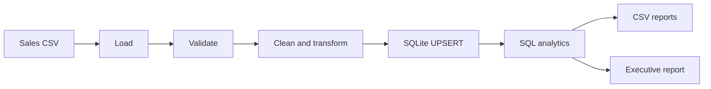

# DataOps Automator

**Database Automation System for Business Sales Operations**

DataOps Automator is a practical local Python system that turns a sales CSV into a validated SQLite dataset, repeatable SQL analytics, and decision-ready business reports. It is designed to demonstrate reliable data operations without requiring an external database, cloud service, or API.

## Business Problem

Sales reporting often relies on manually maintained spreadsheets and repeated copy-and-paste work. That creates duplicate records, inconsistent calculations, fragile reports, and limited auditability.

## Solution

DataOps Automator provides one reusable pipeline that validates incoming sales data, cleans it, upserts it into a constrained SQLite schema, calculates metrics with SQL, and exports both machine-readable CSV summaries and an executive text report.

## Key Features

- CSV ingestion with clear missing-file and format errors
- Required-column and positive-value validation
- Non-mutating pandas transformation with revenue and month fields
- Automatic SQLite database and schema creation
- Parameterized SQL and conflict-safe `order_id` UPSERTs
- Repeatable runs without duplicate sales records
- SQL KPIs and grouped revenue analytics
- CSV exports plus human-readable business report
- Structured file and console logging
- Fully isolated pytest coverage with temporary project roots

## System Workflow



## Architecture

- `config.py`: centralized, testable filesystem settings.
- `data_loader.py`: CSV boundary and load errors.
- `data_validator.py`: required fields and business rules.
- `data_processor.py`: normalized database-ready DataFrame.
- `database_manager.py`: SQLite lifecycle, schema setup, transactions, and cleanup.
- `data_repository.py`: parameterized persistence and retrieval.
- `analytics.py`: SQL aggregation queries.
- `report_exporter.py`: six CSV reports and one text report.
- `workflow.py`: reusable orchestration boundary.
- `main.py`: demonstration CLI.

## Project Structure

```text
DataOps-Automator/
├── data/input/sales_data.csv
├── data/output/              # generated reports, ignored by Git
├── database/                 # generated dataops.db, ignored by Git
├── logs/                     # generated dataops.log, ignored by Git
├── src/
│   ├── analytics.py
│   ├── config.py
│   ├── data_loader.py
│   ├── data_processor.py
│   ├── data_repository.py
│   ├── data_validator.py
│   ├── database_manager.py
│   ├── exceptions.py
│   ├── logger.py
│   ├── main.py
│   ├── models.py
│   ├── report_exporter.py
│   ├── schema.py
│   └── workflow.py
└── tests/
```

## Technology Stack

Python 3.14+, SQLite via the standard `sqlite3` module, pandas, pytest, pathlib, dataclasses, and Python logging.

## Installation

From the `DataOps-Automator` folder:

```powershell
python -m pip install -r requirements.txt
```

## Run the Demo

```powershell
python -m src.main
```

The included 16-row dataset runs without external dependencies beyond the listed packages. The workflow creates `database/dataops.db`, writes `logs/dataops.log`, and generates reports in `data/output/`.

Example output:

```text
DataOps Automator - Database Automation System
================================================
Records processed: 16
Database records: 16
Total Revenue: $27,720.00
Total Orders: 16
Average Order Value: $1,732.50
Total Quantity Sold: 38
Automation completed successfully.
```

## Database Schema

The `sales` table uses `order_id` as its primary key and stores order date, customer, region, product, category, quantity, unit price, calculated revenue, and reporting month. Positive checks on quantity, unit price, and revenue protect the data layer. Re-running the same input updates matching order IDs rather than creating duplicates.

## SQL Analytics

The analytics layer uses SQL `SUM`, `COUNT`, `AVG`, `GROUP BY`, `ORDER BY`, and `LIMIT` to calculate:

- Total revenue, orders, average order value, and quantity sold
- Revenue by region, product, and category
- Monthly revenue trends
- Top products ranked by revenue

## Generated Reports

- `kpi_summary.csv`
- `revenue_by_region.csv`
- `revenue_by_product.csv`
- `revenue_by_category.csv`
- `monthly_revenue.csv`
- `top_products.csv`
- `business_report.txt`

## Testing

Run the complete suite from the project root:

```powershell
pytest
```

Tests cover configuration, loading failures, validation, non-mutating transformations, schema creation, transaction rollback, insertion and UPSERT behavior, SQL analytics, exports, and repeatable end-to-end execution. Pytest is configured with a project-local base temp directory for Windows environments where the system Temp hierarchy is restricted.

## Business Use Cases

- Daily or weekly sales operations reporting
- Regional performance reviews
- Product portfolio analysis
- Data quality gates before loading a warehouse
- Lightweight local automation for small commercial teams

## Future Improvements

- Add configurable input file selection and command-line options
- Add incremental ingestion audit tables
- Add margin, customer lifetime value, and cohort analytics
- Add scheduled execution and email delivery
- Add database migrations and a dashboard presentation layer

## Skills Demonstrated

Data ingestion, validation, pandas transformations, SQLite schema design, transactional persistence, UPSERT design, SQL analytics, reporting automation, logging, exception handling, testing, and modular Python architecture.
