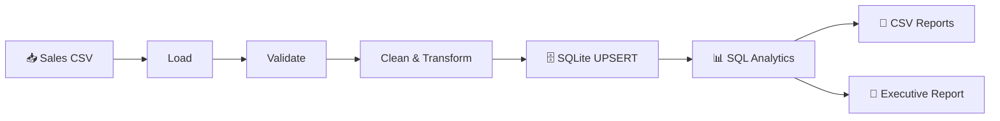

# 🗄️ DataOps Automator

> **A repeatable Python and SQL automation system that transforms raw sales data into a validated SQLite database, business analytics, and decision-ready reports.**


---

# 🎯 The Business Problem

Sales reporting is often managed through manually maintained spreadsheets and repeated copy-and-paste operations. This can create:

- Duplicate records
- Inconsistent calculations
- Weak data validation
- Fragile reporting workflows
- Limited repeatability and auditability

DataOps Automator demonstrates how a structured **Python + SQLite + SQL analytics pipeline** can automate this workflow from ingestion to reporting.

---

# ⚡ The Solution

```text
📥 Sales CSV
     ↓
🛡️ Validate Data
     ↓
🧹 Clean & Transform
     ↓
🗄️ SQLite UPSERT
     ↓
📊 SQL Analytics
     ↓
📤 CSV Reports + Executive Summary
```

The system validates incoming sales data, transforms it into a database-ready format, safely upserts records into SQLite, calculates business metrics using SQL, and automatically exports analytical reports.

---

# ✨ Key Features

- 📥 CSV ingestion with clear missing-file and unsupported-format errors
- 🛡️ Required-column and positive-value validation
- 🧹 Non-mutating pandas transformations
- 💰 Automatic revenue calculation
- 📅 Reporting month generation
- 🗄️ Automatic SQLite database and schema creation
- 🔁 Repeatable `order_id` UPSERT operations
- 🔒 Parameterized SQL queries
- 📊 SQL-based KPIs and grouped revenue analytics
- 📤 Six CSV analytics exports
- 📝 Human-readable executive report
- 📋 Structured console and file logging
- 🧪 **17 automated pytest tests**
- ⚙️ Fully automated end-to-end workflow

---

# 🔄 System Workflow



---

# 🏗️ Architecture

| Module | Responsibility |
|---|---|
| `config.py` | Centralized and testable project settings |
| `data_loader.py` | CSV loading and input-boundary errors |
| `data_validator.py` | Required fields and business-rule validation |
| `data_processor.py` | Data normalization and transformation |
| `database_manager.py` | SQLite lifecycle, transactions, and schema setup |
| `data_repository.py` | Parameterized persistence and retrieval |
| `analytics.py` | SQL aggregation and KPI queries |
| `report_exporter.py` | CSV and executive report generation |
| `workflow.py` | End-to-end orchestration |
| `main.py` | Demo application entry point |

---

# 📁 Project Structure

```text
DataOps-Automator/
│
├── data/
│   ├── input/
│   │   └── sales_data.csv
│   └── output/                 # Generated reports (ignored by Git)
│
├── database/                   # Generated SQLite database (ignored by Git)
├── logs/                       # Generated logs (ignored by Git)
│
├── src/
│   ├── analytics.py
│   ├── config.py
│   ├── database_manager.py
│   ├── data_loader.py
│   ├── data_processor.py
│   ├── data_repository.py
│   ├── data_validator.py
│   ├── exceptions.py
│   ├── logger.py
│   ├── main.py
│   ├── models.py
│   ├── report_exporter.py
│   ├── schema.py
│   └── workflow.py
│
├── tests/
│   └── 17 automated test cases
│
├── .gitignore
├── pytest.ini
├── requirements.txt
└── README.md
```

---

# 🛠️ Technology Stack

| Area | Technologies |
|---|---|
| 🐍 Programming | Python 3.14+ |
| 🗄️ Database | SQLite / `sqlite3` |
| 📊 Data Processing | pandas |
| 🧪 Testing | pytest |
| 📁 File Management | pathlib |
| 📝 Logging | Python logging |

---

# 🚀 Installation

From the `DataOps-Automator` directory:

```powershell
python -m pip install -r requirements.txt
```

# ▶️ Run the Demo

```powershell
python -m src.main
```

The included 16-record sample dataset runs locally without requiring an external database, cloud service, or API.

## Example Result

```text
DataOps Automator - Database Automation System
================================================

Records processed: 16
Database records: 16

Total Revenue: $27,720.00
Total Orders: 16
Average Order Value: $1,732.50
Total Quantity Sold: 38

Reports generated: 7

Automation completed successfully.
```

---

# 🗄️ Database Design

The `sales` table uses `order_id` as its primary key and stores:

- Order date
- Customer
- Region
- Product
- Category
- Quantity
- Unit price
- Calculated revenue
- Reporting month

The database layer uses **UPSERT behavior**, meaning repeated runs with the same `order_id` update existing records rather than creating duplicates.

---

# 📊 SQL Analytics

The analytics layer uses SQL operations including:

- `SUM`
- `COUNT`
- `AVG`
- `GROUP BY`
- `ORDER BY`
- `LIMIT`

It calculates:

### 📈 KPI Summary

- Total revenue
- Total orders
- Average order value
- Total quantity sold

### 🌍 Revenue Analysis

- Revenue by region
- Revenue by product
- Revenue by category
- Monthly revenue trends
- Top products ranked by revenue

---

# 📤 Generated Reports

The automation workflow creates:

```text
📊 kpi_summary.csv
🌍 revenue_by_region.csv
📦 revenue_by_product.csv
🏷️ revenue_by_category.csv
📅 monthly_revenue.csv
🏆 top_products.csv
📝 business_report.txt
```

Generated output files are excluded from Git because they can be recreated automatically by the application.

---

# 🧪 Testing & Verification

Run the complete test suite:

```powershell
pytest
```

## Latest Verified Result

```text
17 passed
```

The tests cover:

- ⚙️ Configuration and directory creation
- 📥 CSV loading and failure handling
- 🛡️ Data validation
- 🧹 Non-mutating data transformation
- 🗄️ Database and schema creation
- 🔄 Transaction rollback behavior
- 🔁 UPSERT and duplicate prevention
- 📊 SQL analytics
- 📤 Report generation
- 🚀 Repeatable end-to-end execution

---

# 💼 Business Use Cases

DataOps Automator can be adapted for:

- Daily or weekly sales reporting
- Regional performance reviews
- Product portfolio analysis
- Data quality checks before database loading
- Automated business operations reporting
- Lightweight local data automation for small teams

---

# 🔮 Future Improvements

- Configurable input file selection
- Command-line options
- Incremental ingestion audit tables
- Margin and profitability analytics
- Customer lifetime value analysis
- Cohort analytics
- Scheduled execution
- Automated email delivery
- Database migrations
- Interactive dashboard layer

---

# 🧠 Skills Demonstrated

`Python` • `SQL` • `SQLite` • `Database Automation` • `Data Validation` • `pandas` • `UPSERT` • `SQL Analytics` • `Reporting Automation` • `Logging` • `Exception Handling` • `pytest` • `Modular Architecture`

---

## 🏆 Portfolio Context

**DataOps Automator is Project #9 in the Automation Service Projects portfolio**, demonstrating practical capabilities in **SQL and database automation**.
