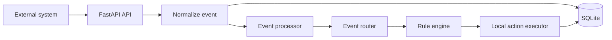

# EventPulse - Webhook & Event Automation System

## Overview

EventPulse is a locally runnable FastAPI service that receives business webhooks, normalizes them into internal events, evaluates deterministic automation rules, prepares safe local actions, and persists the full processing lifecycle in SQLite.

## Business Problem and Solution

Webhook integrations often become fragile when validation, routing, business logic, and side effects are mixed together. EventPulse separates those responsibilities so a client can add event types and automation rules without rewriting its HTTP layer. Actions are simulated locally, making the project safe to demonstrate and test.

## Key Features

- FastAPI webhook and operational APIs
- Pydantic request validation and flexible event payloads
- Event normalization and routing
- Deterministic rule engine for leads, orders, payments, and support tickets
- SQLite persistence with parameterized SQL
- Idempotency protection keyed by `event_id`
- Processing status tracking and structured error responses
- Structured Python logging
- Temporary-database pytest suite

## Architecture



## Event Processing Flow

`POST /webhooks/events` validates the request, normalizes it, checks the unique event ID, persists a processing record, routes the event, evaluates rules, prepares local action results, and stores the completed or failed status. A repeated ID is recorded as a duplicate without re-running actions.

## Supported Event Types and Rules

- `lead.created`, `lead.updated`: website leads with an email receive sales or valid-lead classification; sales terms such as `interested`, `pricing`, `quote`, `demo`, or `buy` raise priority.
- `order.created`: totals at or above 1000 prepare a high-value order flag.
- `payment.received`: prepares local payment recording and confirmation actions.
- `support.ticket_created`: urgent or high priority tickets prepare support routing.
- Unknown event types: complete safely with `no_action`.

## API Endpoints

- `GET /health`
- `POST /webhooks/events`
- `GET /events?limit=50&offset=0`
- `GET /events/{event_id}`
- `GET /events/{event_id}/result`
- `GET /automations/rules`
- `GET /analytics/overview`

## Project Structure

```text
src/
  api/          Pydantic schemas and route surface
  core/         processor, router, rules, and actions
  database/     SQLite connection and repository
  models/       normalized event model
  services/     normalization and service helpers
  config.py
  main.py
tests/          deterministic API and unit tests
docs/           architecture and setup documentation
```

## Technology Stack

Python 3.11+, FastAPI, Pydantic 2, Uvicorn, SQLite, and pytest. The current verification environment uses Python 3.14.

## Installation and Running

```powershell
python -m venv .venv
.\.venv\Scripts\Activate.ps1
python -m pip install -r requirements.txt
uvicorn src.main:app --reload
```

Open Swagger at `http://127.0.0.1:8000/docs`.

## Example Webhook

```json
{
  "event_id": "evt_1001",
  "event_type": "lead.created",
  "timestamp": "2026-09-11T10:30:00Z",
  "source": "website",
  "data": {
    "name": "John Doe",
    "email": "john@example.com",
    "company": "Acme Corp",
    "message": "Interested in a demo"
  }
}
```

Example response:

```json
{
  "event_id": "evt_1001",
  "status": "completed",
  "duplicate": false,
  "result": [
    {"action": "notify_sales", "status": "prepared", "message": "Sales notification prepared"}
  ]
}
```

## Idempotency

`event_id` is the primary key in SQLite. A repeated webhook returns `status: duplicate`, preserves the original record and result, and increments duplicate analytics without executing actions again.

## Security and Production Considerations

Payloads are validated, SQL is parameterized, stack traces are kept out of responses, and no credentials or external calls are required. A production deployment should add signed webhook authentication, HTTPS, secret management, retry/dead-letter policy, metrics, access controls, and a durable queue if processing volume requires asynchronous execution.

## Running Tests

```powershell
pytest -q
```

The suite uses temporary SQLite files and does not depend on existing local data, network access, Docker, n8n, Make, or paid services.

## Portfolio Value

EventPulse demonstrates a practical modular-monolith approach to webhook automation: clear boundaries, explicit business rules, operational visibility, safe side effects, and a testable path from inbound request to persisted outcome.
