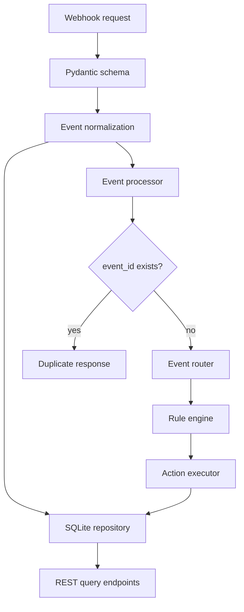

# EventPulse Architecture

## System Architecture

EventPulse is a modular monolith. FastAPI owns transport and validation; services normalize external payloads; the event processor coordinates the workflow; core modules own routing, rules, and action preparation; the repository owns SQLite persistence.

## Components

- **API layer**: exposes health, webhook, event lookup, rules, and analytics endpoints. Validation errors and unexpected failures use structured JSON responses.
- **Normalization layer**: converts the inbound model into `NormalizedEvent`, decoupling business logic from HTTP structure.
- **Event processor**: coordinates persistence, routing, rule evaluation, execution, and final status updates.
- **Router**: maps known event types to named workflows and sends unknown types to a safe no-op route.
- **Rule engine**: contains deterministic, pure rule evaluation for lead, order, payment, and support workflows.
- **Action executor**: returns safe local action records. It never sends emails, SMS, or external requests.
- **Database**: SQLite stores event payloads, statuses, timestamps, results, and errors. SQL uses placeholders.

## Idempotency and Lifecycle

The `events.event_id` primary key makes the initial insert atomic. A failed insert means the event was already accepted; the repository records the duplicate separately and the processor returns without evaluating rules. Normal lifecycle states are `processing`, `completed`, and `failed`; duplicate requests return `duplicate` without modifying the original row.

## Data Flow and Error Handling

A valid request is normalized before processing. Processing failures are logged server-side, persisted in the event row, and converted to a generic API error so implementation details are not exposed. Unknown event types are valid and complete with a `no_action` result.
