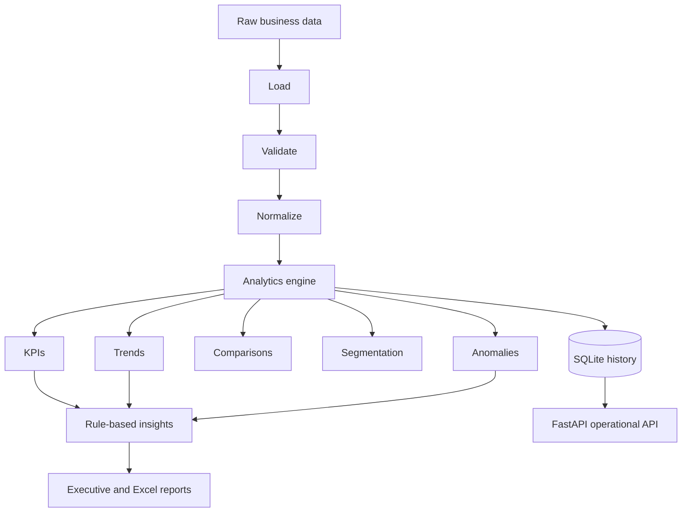

# 📈 InsightFlow — Automated Reporting & Analytics System

> **An analytics engine that transforms e-commerce transactions into validated KPIs, trends, comparisons, customer segments, explainable anomalies, deterministic insights, historical runs, and business-ready reports.**


---

## 🎯 What It Solves

InsightFlow is designed for businesses that need more than a static report. It creates a reproducible analytics pipeline with explicit metric definitions, historical tracking, explainable anomaly detection, segmentation, insights, and operational APIs.

```text
Raw Transactions
      ↓
Load + Validate
      ↓
Normalize
      ↓
Analytics Engine
  ├── KPIs
  ├── Trends
  ├── Comparisons
  ├── Segmentation
  └── Anomalies
      ↓
Rule-Based Insights
      ↓
SQLite History
      ↓
Executive + Excel Reports
      ↓
FastAPI API
```

## 🏗️ Architecture



## 📐 Business Rules & KPI Definitions

- **Revenue:** `quantity × unit_price` using the calculated total rather than an untrusted source total.
- **Completed revenue:** Includes completed transactions only.
- **AOV:** Completed revenue divided by completed orders.
- **Status rates:** Completion, cancellation, and refund rates use total order count as the denominator.
- **Growth:** Compares the latest available month with the previous available month; returns 0 when no comparable period exists.
- **Duplicates:** The first valid `order_id` occurrence is retained and is not double-counted.
- **Customer segments:** 25th and 75th revenue percentiles define low, regular, and high-value segments.
- **Anomalies:** Daily revenue/order z-scores are used, requiring at least four observations.
- **Quality score:** `valid records / input records × 100`.

## 📊 Analytics Capabilities

- Total and completed revenue
- Order and unit counts
- Average order value
- Customer value
- Completion, cancellation, and refund rates
- High-value order analysis
- Daily, weekly, and monthly trends
- Category, product, region, and channel rankings/shares
- Customer segmentation
- Period comparisons
- Explainable anomaly detection
- Rule-based insights and recommendations
- Historical analytics runs and metric snapshots

## 📑 Generated Reports

| Output | Purpose |
|---|---|
| `executive_summary.txt` | Reporting period, KPIs, leaders, growth, quality, and insights |
| `analytics_report.json` | Complete analytics, insights, and quality payload |
| `kpis.json` | KPI-only JSON |
| `clean_sales_data.csv` | Normalized canonical data |
| `insightflow_report.xlsx` | Executive, KPI, comparison, trend, category, product, region, channel, segment, anomaly, quality, and clean-data sheets |

Outputs are generated under `data/output/`.

## 🌐 API

| Method | Endpoint | Purpose |
|---|---|---|
| `GET` | `/health` | Health check |
| `POST` | `/analytics/run` | Process a CSV |
| `GET` | `/analytics/overview` | Latest analytics |
| `GET` | `/analytics/trends` | Trend metrics |
| `GET` | `/analytics/categories` | Category analysis |
| `GET` | `/analytics/products` | Product analysis |
| `GET` | `/analytics/regions` | Regional analysis |
| `GET` | `/analytics/channels` | Channel analysis |
| `GET` | `/analytics/customers` | Customer segments |
| `GET` | `/analytics/anomalies` | Detected anomalies |
| `GET` | `/insights` | Generated insights |
| `GET` | `/reports/latest` | Latest report paths |
| `GET` | `/analytics/runs` | Historical runs |
| `GET` | `/analytics/runs/{run_id}` | One analytics run |
| `GET` | `/data/quality` | Latest quality report |
| `GET` | `/records` | Normalized records |
| `GET` | `/records/{order_id}` | One order |

Swagger/OpenAPI is available at `/docs`.

## 🧪 Verification

**58 deterministic tests** are included.

```powershell
pytest
```

The test suite is isolated from existing runtime files and does not require external services.

## 🚀 Quick Start

```powershell
python -m venv .venv
.\.venv\Scripts\Activate.ps1
python -m pip install -r requirements.txt
python -m src.main
```

Open:

```text
http://127.0.0.1:8000/docs
```

Run the sample analytics workflow:

```powershell
Invoke-RestMethod -Uri http://127.0.0.1:8000/analytics/run -Method Post -ContentType 'application/json' -Body '{}'
```

The sample contains **44 transactions** spanning nine months, four categories, five products, three regions, and three channels.

## 📁 Project Structure

```text
InsightFlow/
├── data/
│   ├── input/
│   └── output/
├── docs/
│   ├── architecture/
│   └── setup/
├── src/
│   ├── api/
│   ├── analytics/
│   ├── core/
│   ├── database/
│   ├── models/
│   └── services/
├── tests/
├── requirements.txt
└── README.md
```

## 🛠️ Technology Stack

`Python 3.11+` • `pandas` • `Pydantic 2` • `FastAPI` • `Uvicorn` • `SQLite` • `pytest` • `httpx` • `openpyxl`

No AI API or external service is required.

## 🔐 Production Considerations

The current implementation is local and deterministic. Production extensions could add scheduled jobs, object storage, PostgreSQL or a warehouse, authenticated role-based access, dashboards, queues, monitoring, alerting, incremental ingestion, schema evolution, and retention policies.

Input paths are restricted to the project data directory and SQL uses bound parameters.

## 💼 Portfolio Value

InsightFlow demonstrates **analytics engineering beyond basic reporting** through explicit business definitions, reproducible calculations, historical run tracking, explainable anomaly detection, segmentation, report automation, API operations, and test isolation.
