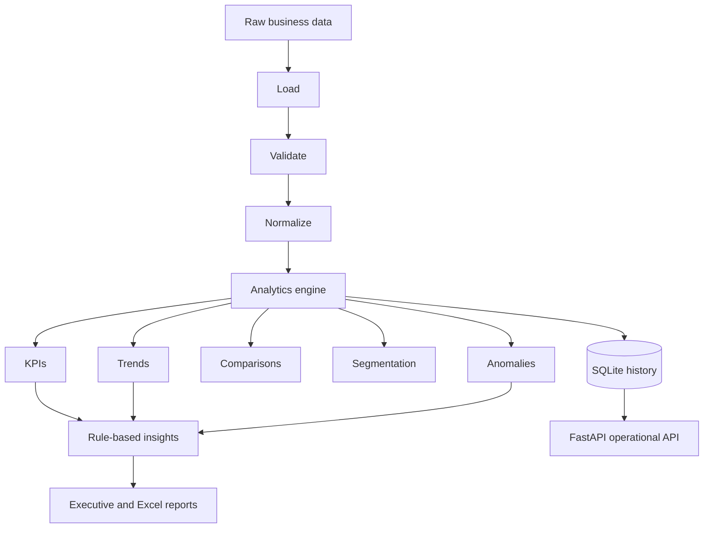

# InsightFlow - Automated Reporting & Analytics System

## Overview

InsightFlow transforms raw e-commerce transactions into validated data, executive KPIs, trend analysis, period comparisons, customer segments, explainable anomalies, deterministic insights, historical analytics runs, and business-ready reports.

## Why It Is Different From Basic Reporting

InsightFlow is an analytics engine rather than a static report template. It combines:

- KPI definitions with safe division and completed-order rules
- Daily, weekly, and monthly trends with growth rates
- Current versus previous-period comparisons
- Category, product, region, and channel analysis
- Percentile-based customer segmentation
- Explainable z-score anomaly detection
- Rule-based insight and recommendation generation
- Historical run and metric snapshot persistence
- Executive text, JSON, CSV, and formatted Excel reporting

## Architecture



## Business Rules and KPI Definitions

- Analytical revenue is `quantity * unit_price` (`calculated_total`), not an untrusted source total.
- Completed revenue and AOV use completed transactions; AOV is completed revenue divided by completed orders.
- Cancelled and refunded orders remain visible in status metrics but do not count as completed revenue.
- Completion, cancellation, and refund rates use total order count as denominator.
- Growth compares the latest available month with the previous available month and returns 0 when no comparable period exists.
- Duplicate `order_id` values retain their first valid occurrence and never double-count in persistence.
- Customer segments use the 25th and 75th revenue percentiles: low value at/below the lower threshold, high value at/above the upper threshold, regular between them.
- Anomalies use daily revenue/order z-scores and require at least four observations.
- The quality score is `valid records / input records * 100`.

## Analytics Capabilities

The engine calculates total/completed revenue, order and unit counts, AOV, customer value, rates, high-value orders, daily/weekly/monthly trends, category/product/region/channel shares and rankings, customer segment summaries, period comparisons, anomalies, and generated recommendations.

## Generated Reports

- `data/output/executive_summary.txt`: reporting period, KPIs, leaders, growth, quality, and insights
- `data/output/analytics_report.json`: complete analytics, insights, and quality payload
- `data/output/kpis.json`: KPI-only JSON
- `data/output/clean_sales_data.csv`: normalized canonical data
- `data/output/insightflow_report.xlsx`: executive, KPI, comparison, trend, category, product, region, channel, segment, anomaly, quality, and clean-data sheets

## API

| Method | Endpoint | Purpose |
|---|---|---|
| GET | `/health` | Health check |
| POST | `/analytics/run` | Process default or data-directory CSV |
| GET | `/analytics/overview` | Full latest analytics |
| GET | `/analytics/trends` | Trend metrics |
| GET | `/analytics/categories` | Category analysis |
| GET | `/analytics/products` | Product analysis |
| GET | `/analytics/regions` | Regional analysis |
| GET | `/analytics/channels` | Channel analysis |
| GET | `/analytics/customers` | Customer segments |
| GET | `/analytics/anomalies` | Detected anomalies |
| GET | `/insights` | Generated insights |
| GET | `/reports/latest` | Latest report paths |
| GET | `/analytics/runs` | Historical runs |
| GET | `/analytics/runs/{run_id}` | One run |
| GET | `/data/quality` | Latest quality report |
| GET | `/records` | Normalized records |
| GET | `/records/{order_id}` | One order |

## Project Structure

```text
InsightFlow/
  data/input/sample_sales_data.csv
  data/output/.gitkeep
  docs/architecture/architecture.md
  docs/setup/setup.md
  src/api/              API schemas and routes
  src/analytics/        KPIs, trends, comparisons, segmentation, anomalies
  src/core/             loading, validation, normalization, orchestration, reports
  src/database/         SQLite schema and repository
  src/models/           Pydantic business models
  src/services/         pipeline-facing services and insight generation
  tests/                58 deterministic tests
```

## Installation

```powershell
python -m venv .venv
.\.venv\Scripts\Activate.ps1
python -m pip install -r requirements.txt
```

## Run

```powershell
python -m src.main
```

Open Swagger at `http://127.0.0.1:8000/docs`.

## Tests

```powershell
pytest
```

## Example Workflow

`CSV -> validation -> normalization -> analytics -> insights -> SQLite -> reports/API`

Run the sample through Swagger or PowerShell:

```powershell
Invoke-RestMethod -Uri http://127.0.0.1:8000/analytics/run -Method Post -ContentType 'application/json' -Body '{}'
```

The sample contains 44 transactions spanning nine months, four categories, five products, three regions, and three channels, with completed, pending, cancelled, and refunded statuses.

## Technology Stack

Python 3.11+, pandas, Pydantic 2, FastAPI, Uvicorn, SQLite, pytest, httpx, and openpyxl. No AI API or external service is required.

## Production Considerations

The current implementation is local and deterministic. Production extensions could add scheduled jobs, object storage, PostgreSQL or a warehouse, authenticated role-based access, dashboards, queues, monitoring, alerting, incremental ingestion, schema evolution, and retention policies. Input paths are restricted to the project data directory and SQL uses bound parameters.

## Portfolio Value

InsightFlow demonstrates analytics engineering beyond basic reporting: explicit business definitions, reproducible calculations, historical run tracking, explainable anomaly detection, segmentation, report automation, API operations, and test isolation.
