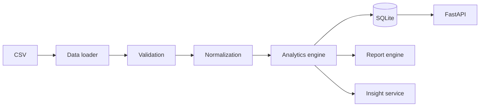

# InsightFlow Architecture

## System Overview

InsightFlow is a deterministic modular monolith. A single pipeline coordinates loading, validation, normalization, analytics, persistence, insights, and report generation. API consumers and direct Python callers use the same pipeline.

## Module Responsibilities

- `core/data_loader.py`: file existence, CSV parsing, required-column checks.
- `core/validator.py`: row-level required values, number, email, date, status, region, and channel checks.
- `core/normalizer.py`: whitespace/case normalization, numeric/date conversion, authoritative calculated totals.
- `analytics/kpis.py`: revenue, order, customer, rate, and AOV definitions.
- `analytics/trends.py`: daily/weekly/monthly series and latest-period growth.
- `analytics/comparisons.py`: equivalent latest-versus-previous available month metrics.
- `core/analytics_engine.py`: category, product, region, and channel breakdowns plus central composition.
- `analytics/segmentation.py`: deterministic percentile-based customer segments.
- `analytics/anomalies.py`: daily z-score spike/drop detection with minimum history.
- `services/insight_service.py`: rule-based descriptions and recommendations.
- `core/report_engine.py`: CSV, JSON, text, and Excel output generation.
- `database/repository.py`: parameterized SQLite upserts, run history, and snapshots.
- `api/routes.py`: operational visibility and path-safe execution endpoint.

## Analytics Architecture

The engine receives a normalized, valid, de-duplicated DataFrame. It returns one structured dictionary containing KPI, trends, comparison, breakdown, segmentation, and anomaly sections. Insights are generated only after those values exist, so natural-language output cannot invent metrics.

### KPI Calculations

Revenue is `quantity * unit_price`. Completed revenue filters `status == completed`. AOV is completed revenue divided by completed orders, with zero for no completed orders. Rates use total orders. All divisions guard against zero.

### Trends and Comparisons

Monthly periods are derived from normalized dates. Trend direction is increasing above 5% growth, decreasing below -5%, otherwise stable. Comparisons use the latest and immediately preceding available month; missing history produces zero growth.

### Segmentation

Customer revenue and order counts are aggregated first. The 25th and 75th revenue percentiles define low-value and high-value boundaries. This remains deterministic for small datasets and records thresholds in the result.

### Anomaly Detection

Daily revenue and order counts are evaluated using population standard deviation. With fewer than four days or zero variance, no anomaly is emitted. A configured z-score threshold controls detection; severity increases at 2.5 and 3 standard deviations.

## Persistence and Historical Runs

`sales_records` uses a unique `order_id` and `ON CONFLICT DO UPDATE`, making repeat processing idempotent. `analytics_runs` stores lifecycle counts, quality, and report paths. `analytics_snapshots` stores scalar KPI/trend/comparison metrics for historical inspection.

## Reporting

Reports receive the same analytics object persisted by the pipeline. Excel sheets mirror the API sections and are sized/frozen for operational use. Runtime database and outputs are ignored by Git; sample input is retained.

## API and Error Handling

`POST /analytics/run` defaults to the sample input and only accepts paths beneath `data/`. Missing data and invalid paths return 400, missing historical resources return 404, and unexpected failures return generic 500 responses without tracebacks.

## Testing and Scalability

Pure analytics functions are tested with realistic DataFrames; pipeline, repository, report, and API tests use temporary directories and databases. A production deployment could move raw files to object storage, use a warehouse or PostgreSQL, schedule jobs, add authentication, and publish metrics and alerts.
