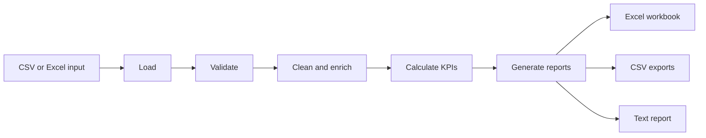

# ReportFlow

**Automated Business Reporting System**

ReportFlow turns everyday sales exports into a decision-ready business performance pack. It ingests CSV or Excel data, validates the input contract, cleans and enriches orders, calculates operational KPIs, and publishes formatted Excel, CSV, and text reports from one repeatable workflow.

## Business Problem

Business teams often spend hours reconciling spreadsheets, calculating recurring metrics, and assembling slide-ready summaries. That manual process is slow, inconsistent, and difficult to audit.

## Solution

ReportFlow provides a modular Python pipeline that makes the reporting process repeatable: one input file becomes validated data, transparent analytical tables, and a professional workbook with summary sheets and charts.

## Key Features

- CSV ingestion with practical `.xlsx` support
- Required-column and business-rule validation
- Missing-value handling, date normalization, and derived revenue
- Total revenue, orders, units, average order value, and ranked views
- Product, category, region, and monthly analysis
- Executive text report and formatted multi-sheet Excel workbook
- Excel charts for product revenue and monthly trends
- Processed orders and summary CSV exports
- File logging, custom exceptions, type hints, and pytest coverage
- Realistic included demo dataset with no external services

## Workflow



## Architecture

- `data_loader.py` owns file-format handling.
- `data_validator.py` enforces the input contract.
- `data_processor.py` produces normalized, analysis-ready rows.
- `analytics.py` creates reusable aggregate tables.
- `report_generator.py` renders the executive text report.
- `excel_exporter.py` creates workbook sheets, styling, and charts.
- `workflow.py` is the orchestration boundary; `main.py` is the CLI entry point.

## Project Structure

```text
ReportFlow/
├── data/input/sales_data.csv
├── data/output/                  # generated, ignored by Git
├── logs/                         # generated logs, ignored by Git
├── src/
│   ├── analytics.py
│   ├── config.py
│   ├── data_loader.py
│   ├── data_processor.py
│   ├── data_validator.py
│   ├── excel_exporter.py
│   ├── exceptions.py
│   ├── logger.py
│   ├── main.py
│   ├── models.py
│   ├── report_generator.py
│   └── workflow.py
└── tests/
```

## Technology Stack

Python 3.10+, pandas, openpyxl, pytest, pathlib, and the standard `logging` library.

## Installation

From this folder:

```powershell
python -m pip install -r requirements.txt
```

## Run the Demo

```powershell
python -m src.main
```

The included dataset contains 15 orders across four regions and six months. A demo run creates files under `data/output/` and logs under `logs/`.

Example terminal output:

```text
ReportFlow demo completed successfully
Revenue: $21,350.00
Orders: 15
Average order value: $1,423.33
Excel report: data/output/reportflow_business_report.xlsx
Text report: data/output/business_report.txt
CSV exports: processed_orders.csv, product_summary.csv, regional_summary.csv, monthly_summary.csv
```

## Run Tests

```powershell
pytest
```

The suite covers configuration, CSV loading failures, validation failures, processing, KPI calculations, text reports, Excel sheets/charts, and the end-to-end workflow.

## Example Outputs

- **Executive Summary**: headline revenue, order count, units, and average order value.
- **Products / Categories / Regions**: ranked revenue, orders, and unit tables.
- **Monthly Trends**: chronological revenue performance with a line chart.
- **CSV exports**: analysis-ready files for downstream BI tools.

## Business Use Cases

- Weekly sales leadership reporting
- Regional performance reviews
- Product portfolio and category planning
- Operations team order-volume monitoring
- Repeatable finance or commercial reporting packs

## Future Improvements

- Add configurable fiscal calendars and currency conversion
- Add scheduled execution and email delivery
- Add customer, margin, and cohort metrics
- Add a dashboard layer with role-based access
- Add schema versioning and data-quality observability

## Portfolio Notes

ReportFlow demonstrates separation of concerns, defensive input handling, reproducible analytics, and practical business communication. It is intentionally usable as a standalone local project and as a foundation for a scheduled reporting service.
