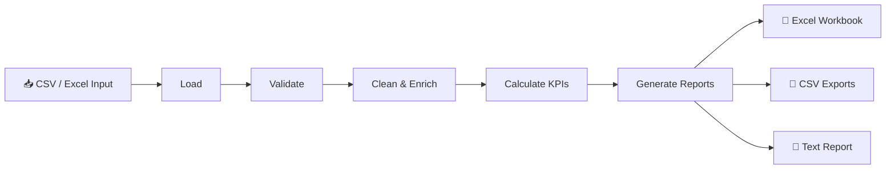

# 📊 ReportFlow

> **Automated Business Reporting System** — Turn raw business data into validated insights and professional reports through one repeatable Python workflow.


---

## 🎯 The Business Problem

Business teams often spend hours reconciling spreadsheets, calculating recurring KPIs, and assembling performance summaries. That manual workflow is slow, repetitive, inconsistent, and difficult to audit.

## 💡 The Solution

**ReportFlow** provides a modular automation pipeline that transforms a business data file into validated, analysis-ready data and multiple professional report formats.

```text
📥 Business Data
       ↓
🔍 Load & Validate
       ↓
🧹 Clean & Enrich
       ↓
📈 Calculate KPIs
       ↓
📊 Generate Reports
       ↓
┌───────────┬───────────┬─────────────┐
│ 📗 Excel  │ 📄 CSV    │ 📝 Text     │
└───────────┴───────────┴─────────────┘
```

---

# ✨ Key Features

- 📥 CSV ingestion with practical `.xlsx` support
- 🛡️ Required-column and business-rule validation
- 🧹 Missing-value handling and data normalization
- 💰 Revenue and business KPI calculations
- 📦 Product and category performance analysis
- 🌍 Regional performance analysis
- 📅 Monthly trend analysis
- 🏆 Top-performing business views
- 📗 Formatted multi-sheet Excel reports
- 📊 Excel charts for product revenue and monthly trends
- 📄 Processed data and summary CSV exports
- 📝 Executive text report generation
- ⚙️ Centralized workflow orchestration
- 📋 Logging and custom exceptions
- 🧪 **12 automated tests**
- 🚀 Included demo dataset with no external services required

---

# 🧠 System Workflow



---

# 🏗️ Architecture

| Component | Responsibility |
|---|---|
| `data_loader.py` | File ingestion and format handling |
| `data_validator.py` | Input contract and business-rule validation |
| `data_processor.py` | Data cleaning and normalization |
| `analytics.py` | Reusable KPI and aggregate calculations |
| `report_generator.py` | Executive text report generation |
| `excel_exporter.py` | Excel workbook, sheets, formatting, and charts |
| `workflow.py` | End-to-end orchestration |
| `main.py` | Application entry point |

---

# 📁 Project Structure

```text
ReportFlow/
│
├── 📂 data/
│   ├── 📂 input/
│   │   └── sales_data.csv
│   └── 📂 output/                 # Generated reports
│
├── 📂 logs/
│
├── 📂 src/
│   ├── analytics.py
│   ├── config.py
│   ├── data_loader.py
│   ├── data_processor.py
│   ├── data_validator.py
│   ├── excel_exporter.py
│   ├── exceptions.py
│   ├── logger.py
│   ├── main.py
│   ├── models.py
│   ├── report_generator.py
│   └── workflow.py
│
├── 📂 tests/
├── README.md
├── requirements.txt
└── pytest.ini
```

---

# 🛠️ Technology Stack

| Category | Technologies |
|---|---|
| 🐍 Programming | Python |
| 📊 Data Processing | pandas |
| 📗 Excel Automation | openpyxl |
| 🧪 Testing | pytest |
| 📁 File Handling | pathlib |
| 📝 Logging | Python `logging` |

---

# 🚀 Quick Start

## 1️⃣ Install Dependencies

```powershell
python -m pip install -r requirements.txt
```

## 2️⃣ Run the Demo

```powershell
python -m src.main
```

The included demo dataset contains **15 orders**, and a successful run produces business reports automatically.

### Example Output

```text
ReportFlow demo completed successfully

Revenue: $21,350.00
Orders: 15
Average order value: $1,423.33

Excel report:
reportflow_business_report.xlsx

Text report:
business_report.txt

CSV exports:
- processed_orders.csv
- product_summary.csv
- regional_summary.csv
- monthly_summary.csv
```

---

# 📊 Generated Report Outputs

### 📗 Excel Business Report

A formatted workbook containing business summaries and analytical views, including charts where applicable.

### 📄 CSV Exports

- Processed orders
- Product summary
- Regional summary
- Monthly summary

### 📝 Executive Text Report

A concise, decision-oriented summary of business performance and core KPIs.

> 📌 Generated report files are intentionally ignored by Git to keep the repository clean.

---

# 🧪 Testing

Run the complete test suite:

```powershell
pytest
```

### Latest Verified Result

```text
12 passed
```

The test suite covers:

- ⚙️ Configuration
- 📥 CSV loading and invalid-file scenarios
- 🛡️ Data validation
- 🧹 Data processing
- 📈 Business analytics and KPI calculations
- 📝 Text report generation
- 📗 Excel sheets and charts
- 🔄 End-to-end workflow execution

---

# 💼 Business Use Cases

ReportFlow can serve as a foundation for:

- 📅 Weekly sales reporting
- 🌍 Regional performance reviews
- 📦 Product and category planning
- 📈 Operations and order-volume monitoring
- 💰 Finance and commercial reporting packs
- 🤖 Future scheduled reporting automation

---

# 🔮 Future Improvements

- ⏰ Scheduled report generation
- 📧 Automated email delivery
- 💱 Currency conversion
- 📅 Configurable fiscal calendars
- 💹 Margin and profitability metrics
- 👥 Customer and cohort analytics
- 📊 Interactive dashboard integration
- 🔐 Role-based access controls
- 🔎 Data-quality observability

---

# 🏆 Portfolio Value

ReportFlow demonstrates practical skills in:

`Python` • `Business Automation` • `Data Processing` • `pandas` • `Excel Automation` • `openpyxl` • `Analytics` • `Reporting` • `pytest`

**Built as a practical, modular foundation for real-world business reporting automation.** 🚀